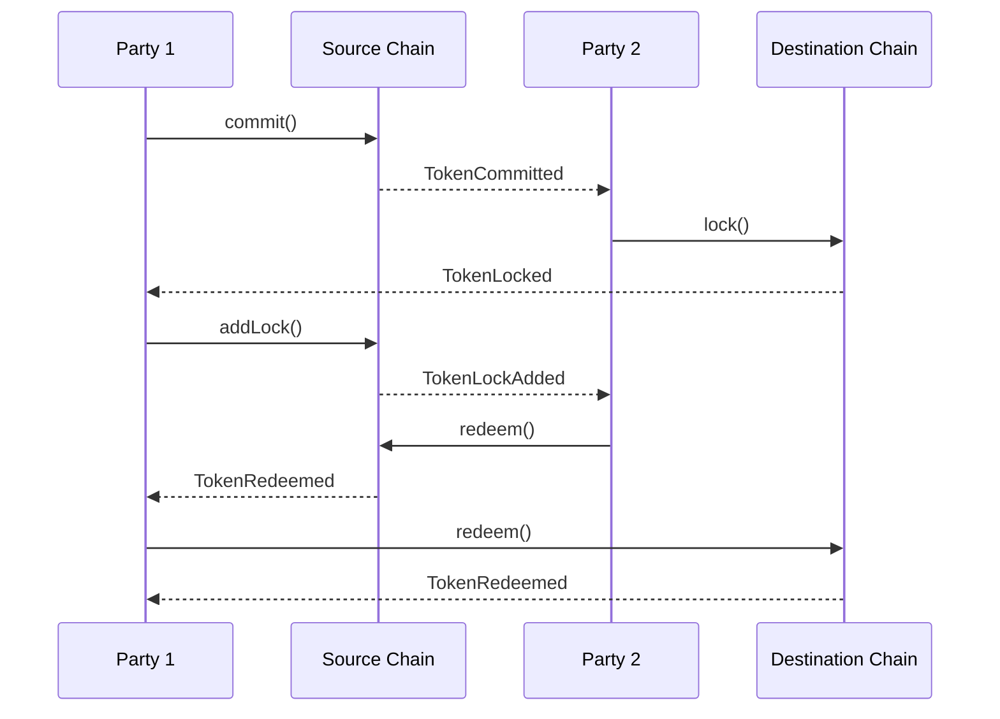
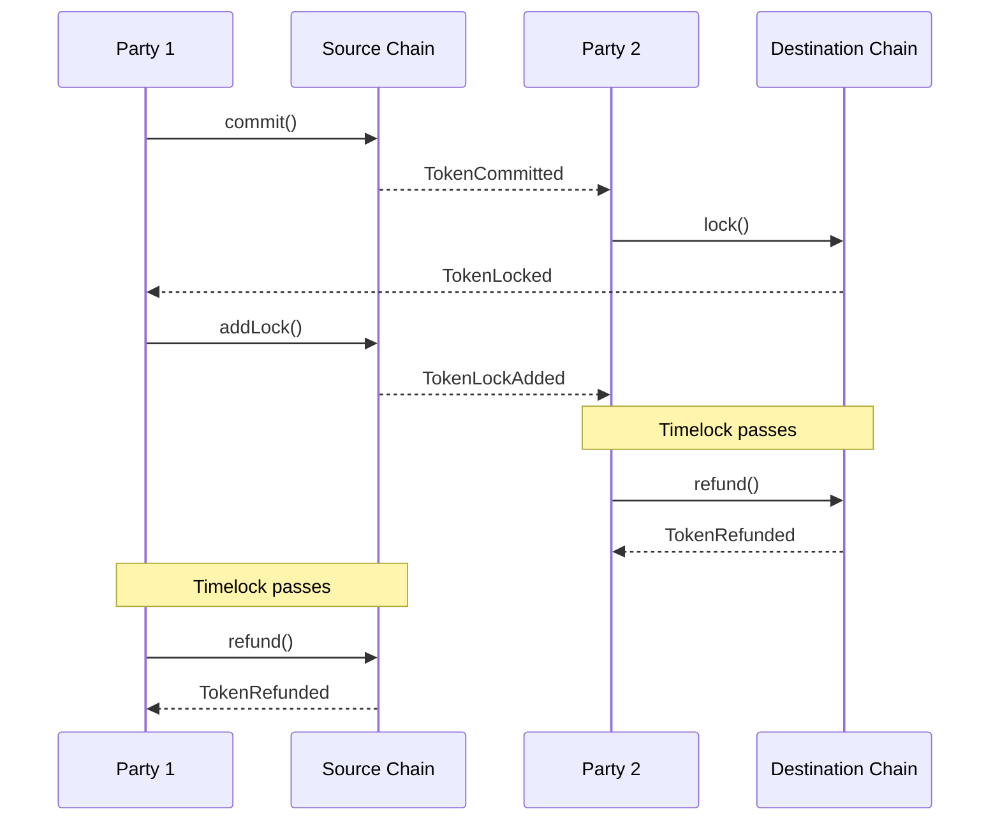
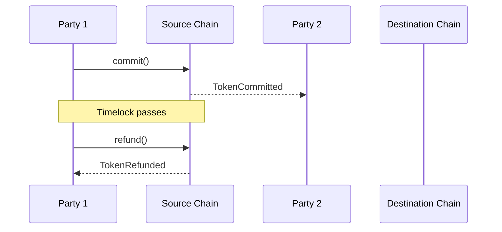

<AccordionGroup>

<Accordion title="Party 2 fails to release Party 1’s funds" icon="brake-warning">

</Accordion>

<Accordion title="Party 2 fails to release at all" icon="brake-warning">

</Accordion>

<Accordion title="Party 1 fails to add lock to the commitment" icon="brake-warning">

### Party 2 fails to act on commitment

</Accordion>
</AccordionGroup>