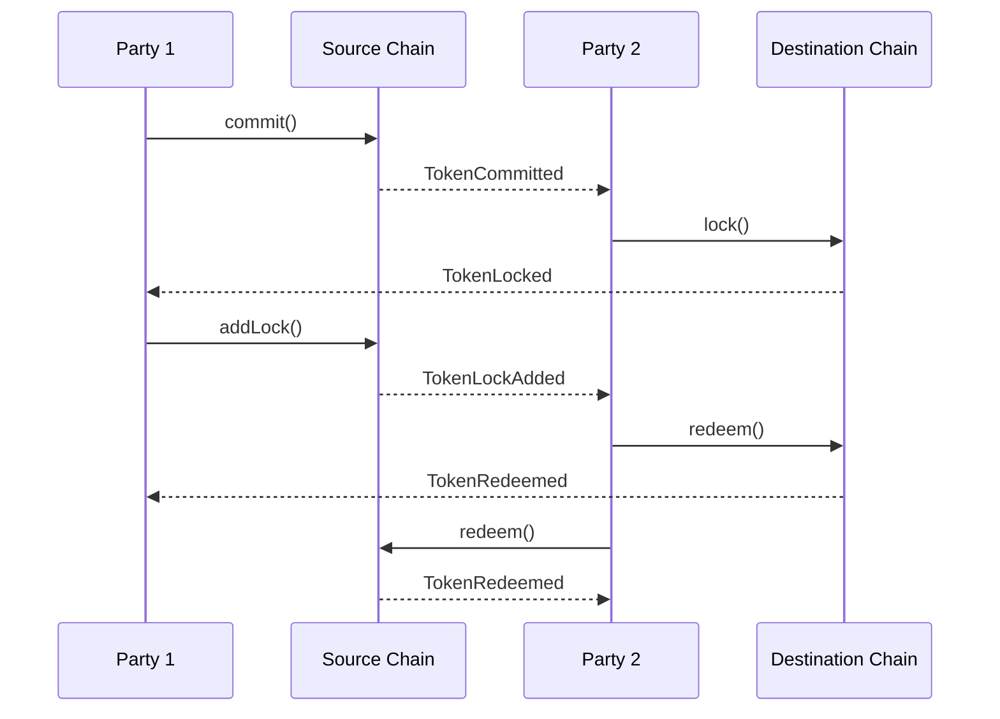
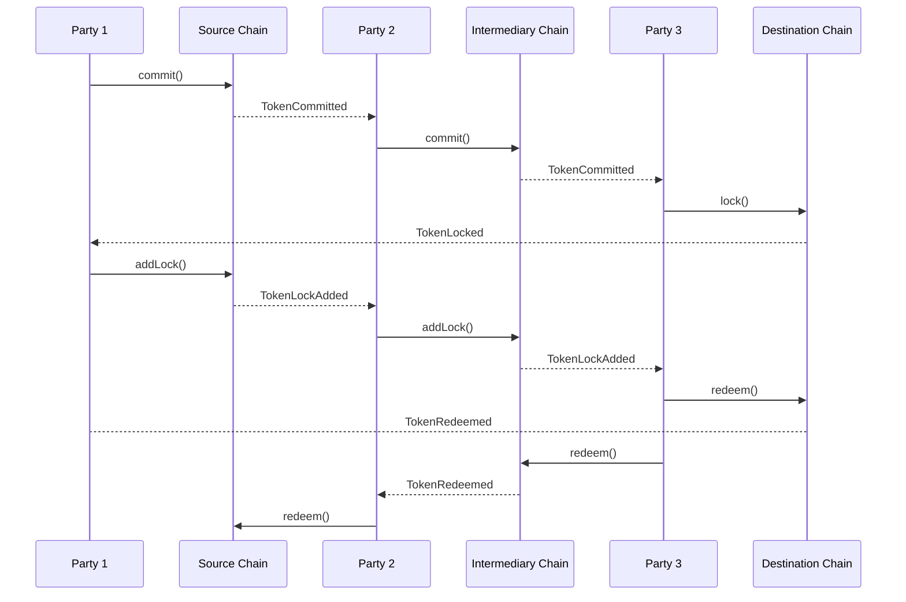

The protocol model relies on atomic swaps for parties exchanging assets across different chains. The model outlines the core flow of assets and actions that should be taken by each party for a successful asset exchange. Depending on the source and destination, and whether there is a party willing to exchange on those chains, either the [Standard flow](#standard-flow) or [Multi-hop flow](#multi-hop-flow) is used.

### Standard flow

When a party directly supports both the source and destination chains and is willing to perform the swap, the standard flow applies. The user initiates the process by calling `commit` and setting the timelock to $T + \beta$, where $T$ is the current timestamp and $\beta$ is the duration for which the user is willing to lock their funds. The party performing the exchange must then call the `lock` function on the destination chain, setting the timelock to $T + 2\Delta$ ($\beta < 2\Delta$), where $\Delta$ is a reasonable duration (e.g., 15 minutes) to ensure the user has time to act and leave sufficient time for the party. Finally, the user calls `addLock`, specifying the timelock $T + \Delta$ and completing their commitment with a hashlock.

Here are the steps:

<Steps>
  <Step title="User Commit">
    The user creates a commit object on the source chain with a timelock of $T + \beta$.
  </Step>
  <Step title="Party Lock">
    The party creates a lock object on the destination chain with a hashlock and a timelock of $T + 2\Delta$.
  </Step>
  <Step title="User AddLock">
    The user adds a lock to the commitment on the source chain, adding a hashlock and updating the timelock to $T + \Delta$.
  </Step>
  <Step title="Party Redeem">
    The party redeems the locked funds on the destination chain.
  </Step>
  <Step title="User Redeem">
    The user redeems the locked funds on the source chain.
  </Step>
</Steps>

<Accordion title="Standard transaction sequence diagram" icon="arrows-left-right">

</Accordion>

### Multi-hop flow

When transferring funds from a source chain to a destination chain is not possible due to the absence of a party directly linking the two, a multi-hop approach is used, with the chain length denoted as $n$. In this process, the user initially commits funds on the source chain to the first party. Each party in the sequence subsequently calls commit, committing funds for the next party, until the final party on the destination chain calls lock. This locks the funds with a hashlock and the longest timelock, set to $T + 2^{n-1}\Delta$, where $T$ is the current timestamp and $\Delta$ is a reasonable duration (e.g., 15 minutes). The Solver on the destination chain locks funds with a duration of $2^{n-1}\Delta$ from the current timestamp, ensuring sufficient time for each Solver in the chain to act.

Following this, each party in the hop-chain, starting from the user to the second-to-last party, performs the addLock function with the same hashlock as used on the destination chain but with progressively shorter timelocks. For the user, the timelock is set to $T + 2^{n-2}\Delta$, while for the second-to-last party, it is $T + 2^0\Delta$. This pattern continues recursively, with each party adding a lock using the hashlock and a timelock specific to their position in the chain.

When the party on the destination chain calls redeem and reveals the secret, they transfer the user's funds and redeem the locked funds for themselves. This revelation of the secret allows each preceding party in the chain to sequentially redeem their funds, completing the multi-hop swap.

Here are the steps:

import MultihopSteps from '/snippets/multihop-steps.mdx';

<MultihopSteps></MultihopSteps>

<Accordion title="Multihop transaction sequence diagram" icon="arrows-turn-to-dots">

</Accordion>